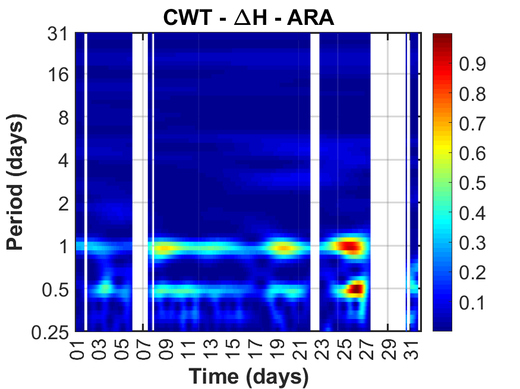
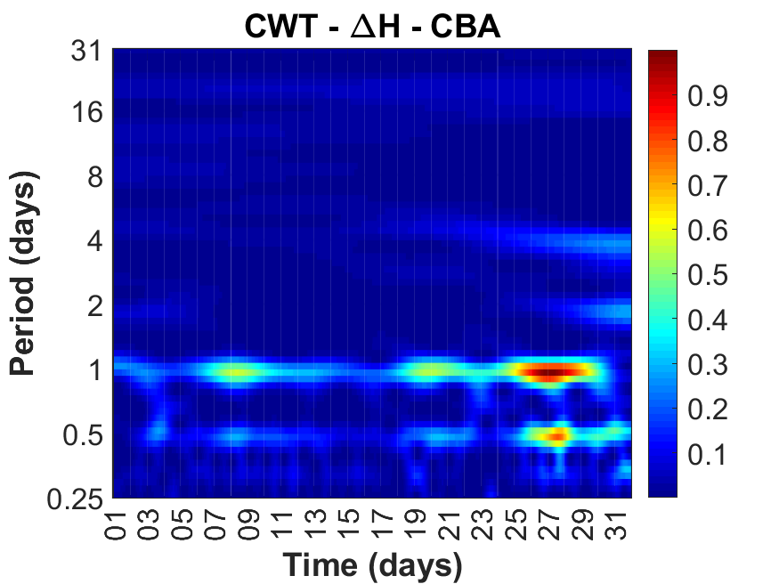
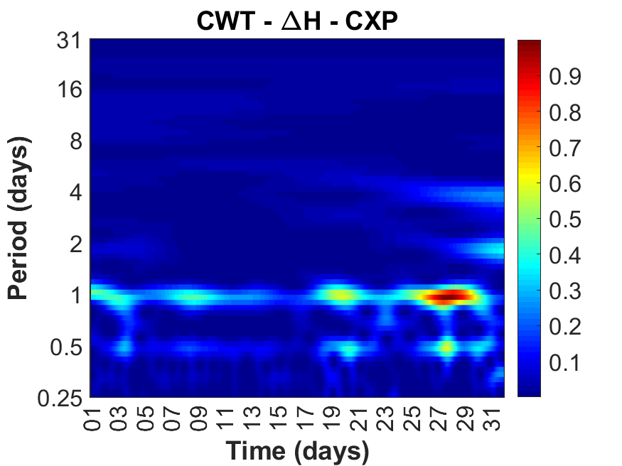
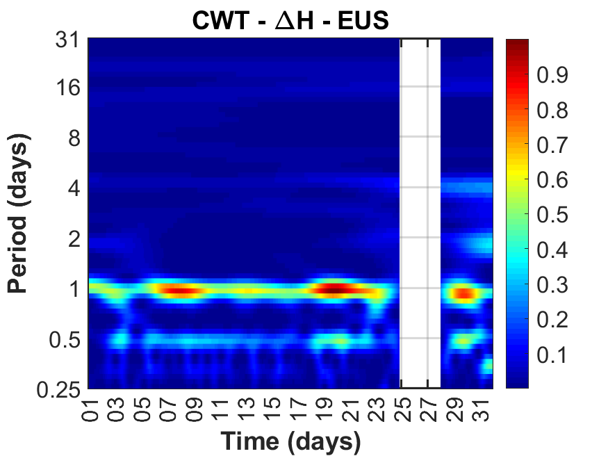
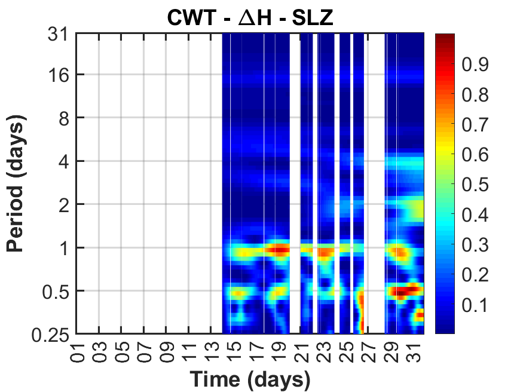
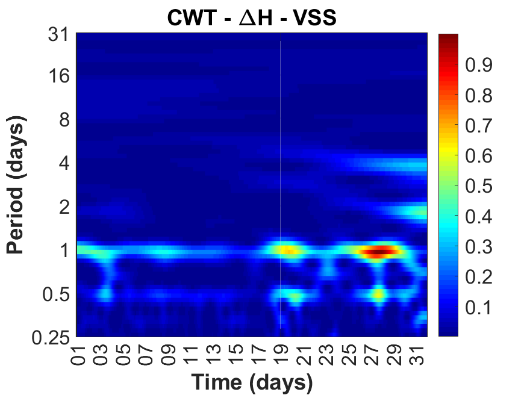

# 🌍 Análise CWT de Variações Magnetométricas (ΔH) — Agosto 2017

Este repositório contém scripts MATLAB desenvolvidos para realizar a **Análise Wavelet Contínua (CWT)** de dados de **magnetômetros** coletados em diferentes estações brasileiras, com passo temporal de **5 minutos**, no período de **01/08/2017 a 31/08/2017**. O objetivo é estudar a variabilidade temporal e periodicidades de **variações do campo magnético horizontal (ΔH)**, identificando padrões e perturbações geomagnéticas.

---

## 🛠 Tecnologias Usadas

- **MATLAB (R2019b ou superior recomendado)**
- **Wavelet Toolbox**
- **Dados de magnetômetros das estações ARA, CBA, CXP, EUS, SLZ e VSS**


---

## 💡 Objetivo

O projeto realiza a análise espectral de séries temporais ΔH de magnetômetros, permitindo:

- 🌀 Identificação de periodicidades entre **0,25 a 31 dias**
- 🔍 Localização temporal de eventos geomagnéticos significativos
- 🌙 Observação de variações diurnas e noturnas
- 🧽 Tratamento automático de dados ausentes (NaN)
- 📊 Geração de mapas espectrais tempo–período de alta resolução

Cada estação possui seu próprio arquivo `.csv` de entrada e gera um gráfico CWT correspondente.

---

## 📂 Estrutura do Projeto

```
cwt_magnetometro/
├── dados/
│ ├── arg_magnetometro.csv
│ ├── cba_magnetometro.csv
│ ├── cxp_magnetometro.csv
│ ├── eus_magnetometro.csv
│ ├── slz_magnetometro.csv
│ └── vss_magnetometro.csv
│
├── codigo_cwt_magnetometro.m # Script principal de análise
└── README.md # Este arquivo
```


---

## ▶️ Como Executar

1. Clone o repositório:

```bash
git clone https://github.com/seuusuario/cwt_magnetometro.git
cd cwt_magnetometro
```

2. Abra o MATLAB.

3. Garanta que todos os arquivos .csv estejam na pasta dados/ ou no mesmo diretório do script.

4. Execute o script:

```bash
run codigo_cwt_magnetometro.m
```

O script irá gerar **1 gráfico CWT por estação**, mostrando ΔH em função do tempo e do período em dias.

---

## 🧪 Dados Utilizados

Os arquivos `.csv` contêm:

- **Hour** — hora da medição
- **dH** — variação horizontal do campo magnético

**Estações analisadas:**

- ARA — Araguatins (TO)
- CBA — Cachoeira Paulista (SP)
- CXP — Campos (RJ)
- EUS — Eusébio (CE)
- SLZ — São Luís (MA)
- VSS — Vassouras (RJ)

**Período:** 01/08/2017 a 31/08/2017, com intervalo de 5 minutos.

---

## 📈 Gráficos Gerados

<div align="center"> <h4><strong>ARA — Araguatins (TO)</strong></h4>  
</div> <div align="center"> <h4><strong>CBA — Cachoeira Paulista (SP)</strong></h4>  
</div> <div align="center"> <h4><strong>CXP — Campos (RJ)</strong></h4>  
</div> <div align="center"> <h4><strong>EUS — Eusébio (CE)</strong></h4>  </div> 
<div align="center"> <h4><strong>SLZ — São Luís (MA)</strong></h4>  </div> 
<div align="center"> <h4><strong>VSS — Vassouras (RJ)</strong></h4>  </div>

---

## 🤝 Agradecimentos

Este projeto foi desenvolvido como parte de estudos em **Geomagnetismo e Física Espacial**, com suporte de colegas na coleta e validação dos dados das estações magnetométricas.

---

## 📜 Licença

Este repositório está licenciado sob **MIT License**. Consulte o arquivo LICENSE para mais informações.
